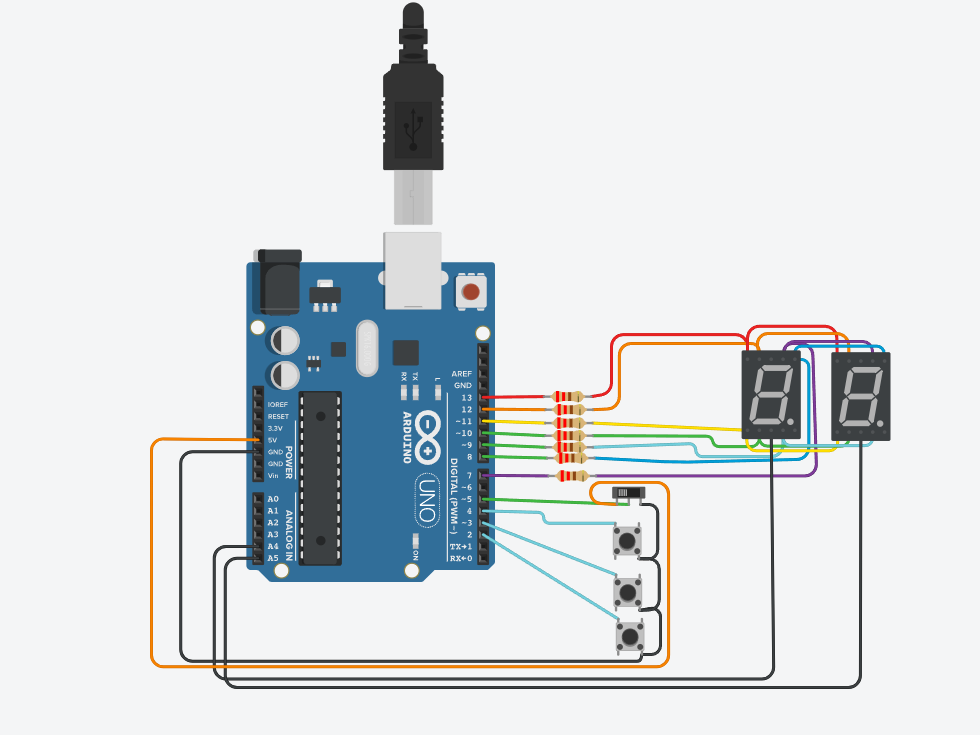
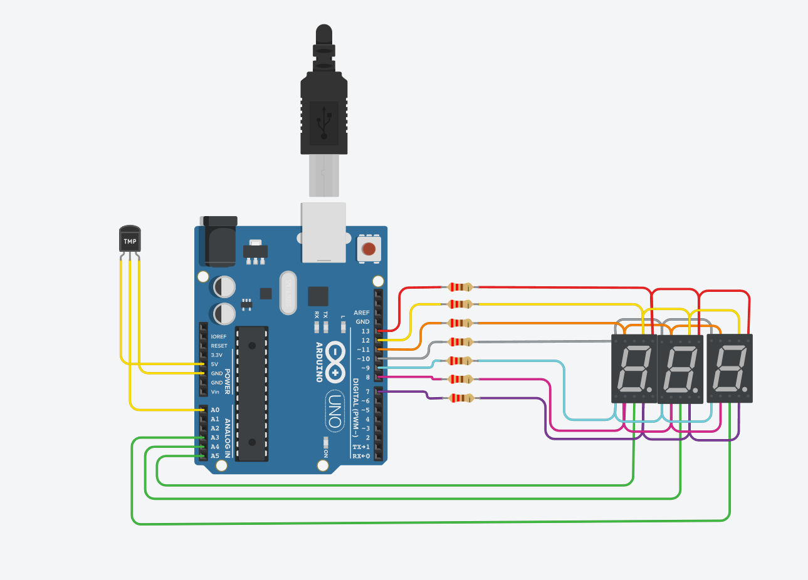
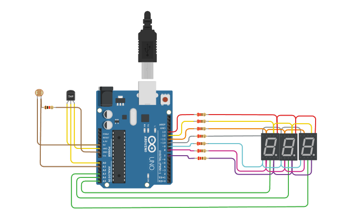
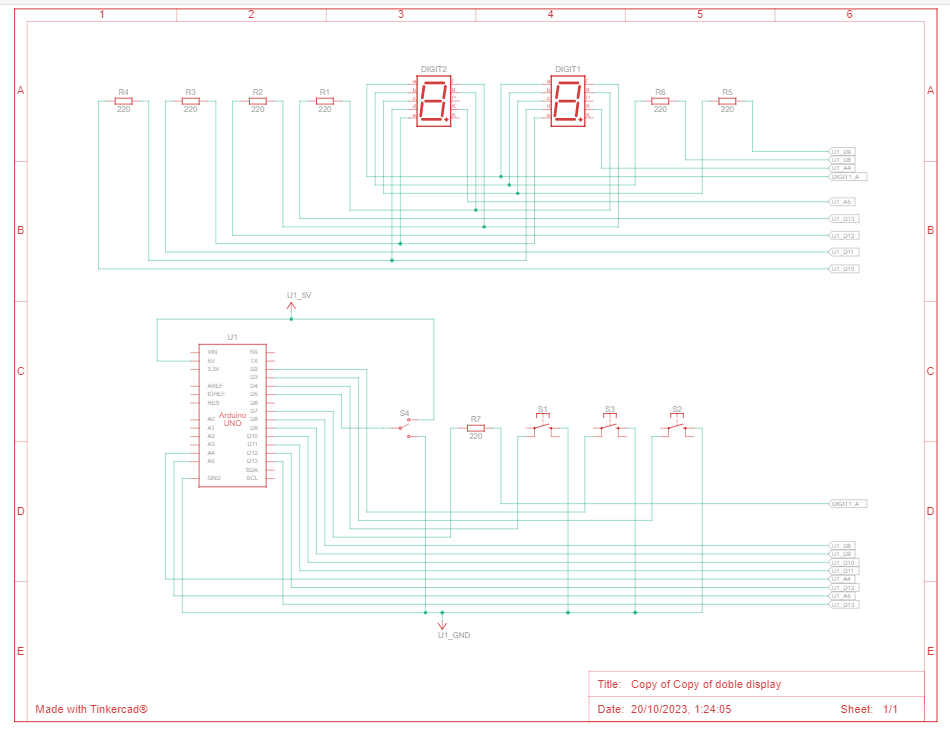
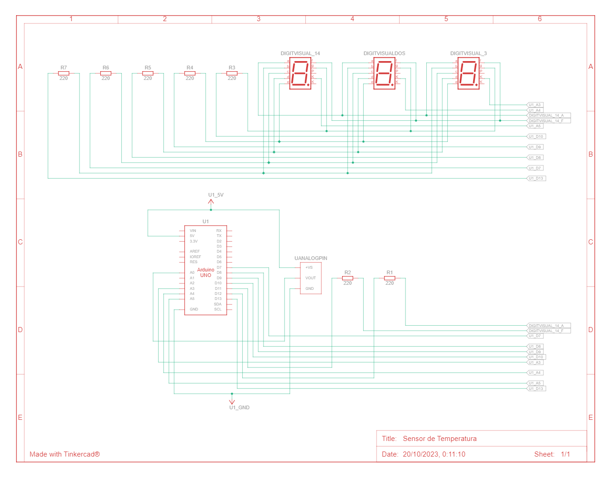

# Proyecto SPD

## Integrantes 
- [Dylan Peralta](https://github.com/Dylan-Peralta/Spd-1H/)
- Brian Romeo

## Proyecto: 
### Contador con dos displays de 7 segmentos.

### Contador y numeros primos con Swicht.

### Sensor de temperatura.

### Sensor de temperatura con fotoresistencia.

## Descripción
### Contador con dos displays de 7 segmentos.
El funcionamiento de este proyecto es contar, descontar o resetear dependiendo de lo que desea el usuario, mostrandolo por dos display con la tecnica de multiplexación.

### Contador y numeros primos con Swicht.
El funcionamiento de este proyecto es contar, descontar o resetear dependiendo de lo que desea el usuario, agregandole un swicht dandole funcionamiento de poder contar numeros primos o numeros del 0 al 99 y mostrarlos por display.

### Sensor de temperatura.
El funcionamiento de este proyecto es poder mostrar la temperatura deseada por display de 7 segmentos de -40° a 125°. 

### Sensor de temperatura con fotoresistencia.
Se le agrega al sensor, la posibilidad de dependiendo la entrada de luz con la fotoresistencia se puda controlar que temperaturas mostrar.

## Función principal

### Contador con dos displays de 7 segmentos.
Esta Funcion se encargara de encender los display correspondientes con el dato informado.

En el primer caso obtenemos el valor del contador y lo dividimos por 10, para obtener el numero de la decena
luego prendemos el display correspondiente a la misma para mostrar el numero indicado. 
(por ejemplo si el numero indicado es 20, al dividirlo por 10, nos devolvera 2, por lo que el primer display mostrara el numero 2)

luego mediente un delay controlaremos el encendido del siguiente display.
el cual al informarle el numero, le restaremos el resultado de la cuenta anterior, multiplicado por 10, para hallar la centena
(por ejemplo si el numero indicado es 20, al dividirlo por 10, nos devolvera 2, y al multiplicarlo por 10, nos devovlera nuevamente 20,
por ende al restarle el numero dado nos devolvera 0 como numero a mostrar en el segundo display)

~~~ C (lenguaje en el que esta escrito)
void manejarDisplay(int contadorNumeros)
{
  numerosDisplay(contadorNumeros/10); 
  prenderDisplay(1,0);
  delay(50);
  numerosDisplay(contadorNumeros - 10*((int)contadorNumeros/10)); 
  prenderDisplay(0,1);
  delay(50);
}
~~~

### Contador y numeros primos con Swicht.
Se le agrega al caso anterior la funcion swPrimosContador dando la posibilidad al usuario de poder contar del 0 al 99 o numeros primos.

En el estado 1 del switch se llama a la funcion esPrimo para poder definir si el numero dado es primo para mostrarlo en el display y en el estado 0 vuelve a llamar a la funcion numerosDisplay para mostrar los numeros del 0 al 99.

~~~ C (lenguaje en el que esta escrito)
swPrimosContador = digitalRead(switchPrimos);

  int presionoTecla = teclaPrecionada();

    if(swPrimosContador == 1)
    {
      if(estadoSw == 0)
      {
        contadorNumeros =0;
        estadoSw = 1;
      }
      contadorNumeros = manejoPulsadores(presionoTecla);
      numeroPrimo = esPrimo(contadorNumeros);
      //llamamos la funcion para el manejo de los display
      manejarDisplay(numeroPrimo);
    }
  else
  {
    if(estadoSw == 1 )
      {
        contadorNumeros =0;
        estadoSw = 0;
      }
    contadorNumeros = manejoPulsadores(presionoTecla);
      //llamamos la funcion para el manejo de los display
      manejarDisplay(contadorNumeros);
  }
~~~

### Sensor de temperatura.
La funcion map consiste en definir el valor del rango del sensor de temperatura. Dependiendo del valor tomado por map se calcula la centena, decena o unidad y prendera el display correspondiente.

~~~ C (lenguaje en el que esta escrito)
void loop()
{
    temperaturaTomada = map(analogRead(sensor), 20, 358, -40, 125);
    centena = temperaturaTomada / 100;
    decena = (temperaturaTomada - (centena * 100)) / 10;
    unidad = temperaturaTomada - (centena * 100 + decena * 10);

    displayApagado();

    if (temperaturaTomada >= 100)
    {
        displayCentenaFunction();
        sevenDisplay(centena);

        displayDecenaFunction();
        sevenDisplay(decena);

        displayUnidadFunction();
        sevenDisplay(unidad);
    }
    if (temperaturaTomada >= 0 && temperaturaTomada <= 100)
    {
        displayApagado();
        displayDecenaFunction();
        sevenDisplay(decena);
        displayUnidadFunction();
        sevenDisplay(unidad);
    }
    if (temperaturaTomada < 0)
    {
        displayCentenaFunction();
        sevenDisplay(-1);

        displayDecenaFunction();
        sevenDisplay(abs(decena));

        displayUnidadFunction();
        sevenDisplay(abs(unidad));
    }
}
~~~
### Sensor de temperatura con fotoresistencia.
La fincion en este caso se agrega en el loop la misma toma los valores que puede interpretar con la fotoresistencia y mediante if
logramos que la temperatura se muestre o no

~~~ C (lenguaje en el que esta escrito)
void loop()
{
    temperaturaTomada = map(analogRead(sensor), 20, 358, -40, 125);
    centena = temperaturaTomada / 100;
    decena = (temperaturaTomada - (centena * 100)) / 10;
    unidad = temperaturaTomada - (centena * 100 + decena * 10);
	luzEntrante = analogRead(fotoResistencia);
  
    displayApagado();
	
//Dependiendo de la luz entrante 
//SE va a definir el umbral de temperaturas a tomar 
//si la luz entrante supera los niveles 60 
//se tomaran las temperaturas superiores a 100
  if(luzEntrante > 60)
  
  {
    if (temperaturaTomada >= 100)
    {
        displayCentenaFunction();
        sevenDisplay(centena);

        displayDecenaFunction();
        sevenDisplay(decena);

        displayUnidadFunction();
        sevenDisplay(unidad);
    }
  }
//Si la luz entrante esta en el umbral entre 30 y 60
//se mostraran las temperaturas desde 0 a 100
  if(luzEntrante > 30 && luzEntrante< 60)
  {
    if (temperaturaTomada >= 0 && temperaturaTomada <= 100)
    {
        displayApagado();
        displayDecenaFunction();
        sevenDisplay(decena);
        displayUnidadFunction();
        sevenDisplay(unidad);
    }
  }
//Por ultimo si la luz entrante esta en el umbral de 0 a 30
// la temperatura a mostrar seran las negativas
  if(luzEntrante >= 0 && luzEntrante< 30)
  {
    if (temperaturaTomada < 0)
    {
        displayCentenaFunction();
        sevenDisplay(-1);

        displayDecenaFunction();
        sevenDisplay(abs(decena));

        displayUnidadFunction();
        sevenDisplay(abs(unidad));
    }
  }
}
~~~
## :robot: Link del proyecto
- [Contador con 2 display 7 segmentos](https://www.tinkercad.com/things/4o4MSXtLEbl)
- [Contador y numeros primos con Swicht](https://www.tinkercad.com/things/936vb1Llbhp)
- [Sensor de temperatura](https://www.tinkercad.com/things/2xuGhtuZf7x)
- [Sensor de temperatura con fotoresistencia](https://www.tinkercad.com/things/7ZuiWBMPjne)
 
## Vista Esquematica 
### Vista Esquematica Contador con 2 display 7 segmentos

### Contador y numeros primos con Swicht

### Sensor de temperatura

### Sensor de temperatura con fotoresistencia

## :tv: Armado del circuito electrico
- [Contador con 2 display 7 segmentos](https://www.youtube.com/watch?v=jq-v3suBJPo&ab_channel=DylanPeralta)
- [Contador y numeros primos con Swicht](https://www.youtube.com/watch?v=XDhogpwIkh4&ab_channel=DylanPeralta)
- [Sensor de temperatura](https://www.youtube.com/watch?v=nUNdTDXHTAg&ab_channel=DylanPeralta)
---
### Fuentes
- [Consigna 1](https://drive.google.com/file/d/1UTj8HBPnR7vM235m1BswtL_SMnmYe8nO/view).
 
- [Consigna 2](https://drive.google.com/file/d/1XqrbtfLN_CeVb0dMFU-xou7SnRTsX9bv/view).
 
- [Guia de uso display 7 segmentos](https://www.youtube.com/watch?v=_Ry7mtURGDE&list=PL7LaR6_A2-E11BQXtypHMgWrSR-XOCeyD&index=4&ab_channel=UTNFRA).
 
- [Guia de uso sensor de temperatura](https://www.youtube.com/watch?v=8AkxV-vMYWY&list=PL7LaR6_A2-E11BQXtypHMgWrSR-XOCeyD&index=5&t=1641s&ab_channel=UTNFRA).

---
