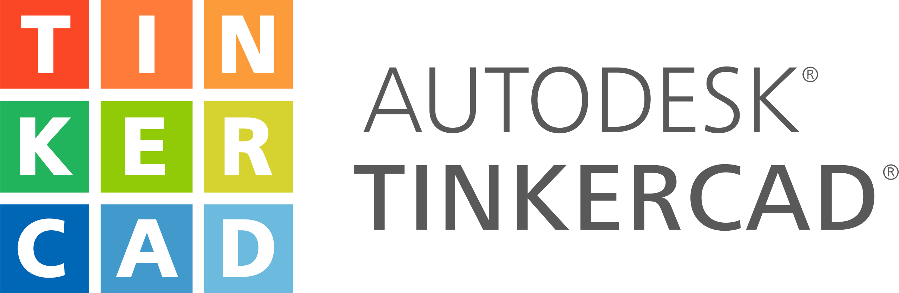
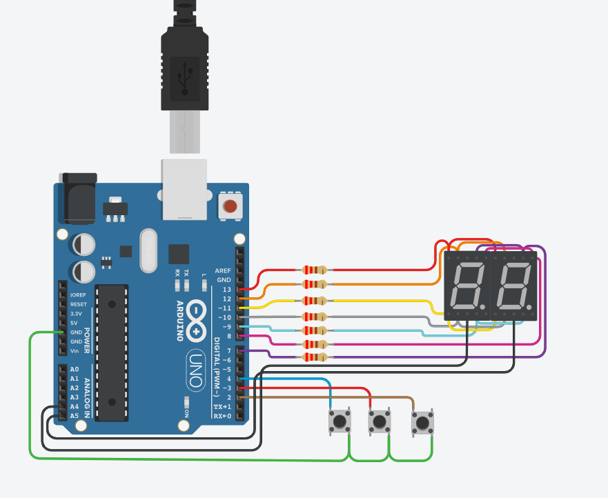
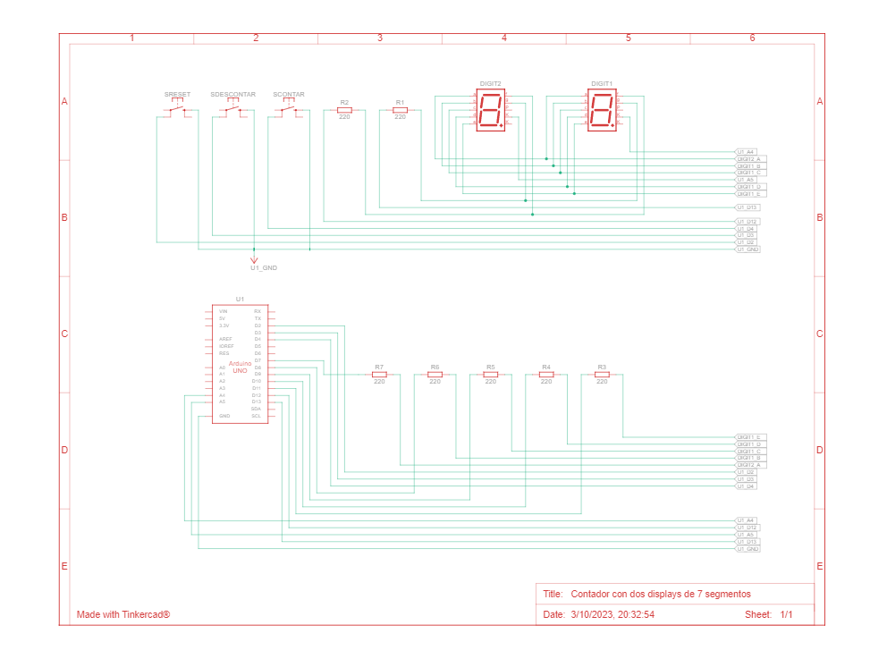

# spd
Utn-spd

## Integrantes 
- Dylan Peralta
- Brian Romeo

## Proyecto: Contador con dos displays de 7 segmentos.

## Descripción
El funcionamiento de este proyecto es contar, descontar o resetear dependiendo de lo que desea el usuario, mostrandolo por dos display con la tecnica de multiplexación

## Función principal
Esta Funcion se encargara de encender los display correspondientes con el dato informado.

En el primer caso obtenemos el valor del contador y lo dividimos por 10, para obtener el numero de la decena
luego prendemos el display correspondiente a la misma para mostrar el numero indicado. 
(por ejemplo si el numero indicado es 20, al dividirlo por 10, nos devolvera 2, por lo que el primer display mostrara el numero 2)

luego mediente un delay controlaremos el encendido del siguiente display.
el cual al informarle el numero, le restaremos el resultado de la cuenta anterior, multiplicado por 10, para hallar la centena
(por ejemplo si el numero indicado es 20, al dividirlo por 10, nos devolvera 2, y al multiplicarlo por 10, nos devovlera nuevamente 20,
por ende al restarle el numero dado nos devolvera 0 como numero a mostrar en el segundo display)

~~~ C (lenguaje en el que esta escrito)
void manejarDisplay(int contadorNumeros)
{
  numerosDisplay(contadorNumeros/10); 
  prenderDisplay(1,0);
  delay(50);
  numerosDisplay(contadorNumeros - 10*((int)contadorNumeros/10)); 
  prenderDisplay(0,1);
  delay(50);
}
~~~

## :robot: Link del proyecto
- [Proyecto](https://www.tinkercad.com/things/4o4MSXtLEbl)

## Vista Esquematica 

 
## :tv: Link al video del proceso
- [video](https://www.youtube.com/watch?v=VyGjE8kx-O0)

---
### Fuentes
- [Consigna](https://drive.google.com/file/d/1UTj8HBPnR7vM235m1BswtL_SMnmYe8nO/view).

- [Lenguaje Markdown](https://markdown.es/sintaxis-markdown/#linkauto).

- [Markdown Cheatsheet](https://github.com/adam-p/markdown-here/wiki/Markdown-Cheatsheet).

- [Tutorial](https://www.youtube.com/watch?v=oxaH9CFpeEE).

- [Emojis](https://gist.github.com/rxaviers/7360908).

---

